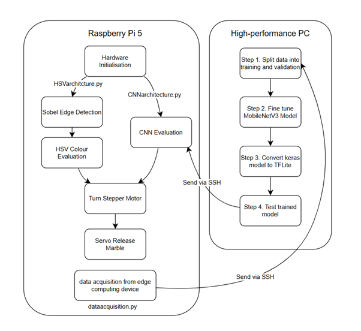

# HSV and CNN-Based Marble Sorter — Software

## Introduction

This repository contains the source code and supporting software materials for an automated marble sorting machine built on a Raspberry Pi 5. The machine classifies marbles by colour and type using two distinct computer vision architectures: HSV-based colour segmentation and a CNN-based deep learning classifier. Then the system actuates a stepper-motor-driven distribution chute to sort them into the correct bin.

The software controls the full pipeline of the machine: camera capture, image pre-processing, marble detection via Sobel edge detection, colour/class inference via HSV or CNN, and motor actuation (stepper motor and servo gate). A Sobel edge detection algorithm is employed to reduce false-positive by ensuring the system only attempts classification when a marble is physically present in the evaluation area.

---

## Contextual Overview

The Raspberry Pi 5 acts as the central processing unit. The diagram below shows the high-level data and control flow of the system:

```

```

HSV + Sobel Edge Detection Architecture: Before any inference, a Sobel operator is applied to each captured frame. If the number of edge pixels above a binary threshold exceeds a certain predetermined number, the system proceeds to the evaluation state. Otherwise, it remains idle. This prevents false classifications when no marble is present. Then, raw RGB frames from the camera are converted to HSV colour space. Predefined HSV masks for each marble colour are applied. The mask with the highest pixel count above a threshold determines the marble's category.

CNN Architecture: Raw frames are resized to 320×320, normalised to float32, and passed to a MobileNetV3-based TFLite model fine-tuned on a custom dataset of five classes: `none`, `white`, `blue`, `green`, `transparent`. The class with the highest softmax output is selected.

---

## Repository Structure

```
/
├── Final/                    # Production code running on the Raspberry Pi
│   ├── CNNarchitecture.py    # Full sorting pipeline using the TFLite CNN model
│   ├── HSVarchitecture.py    # Full sorting pipeline using HSV colour segmentation
│   └── dataacquisition.py    # Camera capture script for dataset collection
│
├── Finetuning/                                     # CNN training scripts (run on PC, not Raspberry Pi), Full credits to: https://www.youtube.com/watch?v=12GvOHNc5DI
│   ├── Step1-Prepare-Data.py                       # Splitting the data into training and validation datasets
│   ├── Step2-Build-The-Model.py                    # Fine-tune MobileNetV3 using datasets
│   ├── Step3-Quantising_Model_For_Deployment.py    # Converts trained .keras model to .tflite 
|   └── Step4-Test-The-Model.py                     # Validates TFLite model output on test images
│
├── dataset/                  
│   ├── dataset_for_model/  # Training and Validation images organised by class (after Step1-Prepare-Data.py is executed)
│   │    ├── train/
│   │    │   ├── blue/
│   │    │   ├── green/
│   │    │   ├── white/
│   │    │   ├── transparent/
│   │    │   └── none/
│   │    ├── val/
│   │    ├── MarbleV3.keras      # Exported keras model (after Step2-Build-The-Model.py is executed)
│   │    └── MarbleV3.tflite     # Exported TFLite model (after Step3-Quantising_Model_For_Deployment.py is executed)
│   ├── marble_dataset/       # data acquistion from raspberry pi should be saved in this directory separated by class
|   ├── test_images
```

---

## Installation Instructions

### Hardware and Language

- Raspberry Pi 5 running Raspberry Pi OS (64-bit)
- Pi Camera Module 3
- Python 3.13.5

### Raspberry Pi Setup

It is recommended to use a Python virtual environment with access to system packages (required for `picamera2`):

```bash
python3 -m venv tflite-env --system-site-packages
source tflite-env/bin/activate
```

### Install Dependencies

```bash
pip install gpiozero==2.0.1
pip install numpy==2.2.4
pip install opencv-python==4.10.0
pip install picamera2==0.3.33
pip install tensorflow==2.18.0
```

Note: `tensorflow` is required for the TFLite interpreter. A standalone `tflite-runtime` package is not separately available for this platform/version combination.

### PC Setup (for CNN fine-tuning only)

Fine-tuning is computationally intensive and should be run on a separate machine with a GPU or higher CPU spec:

```bash
pip install tensorflow==2.18.0
pip install numpy==2.2.4
pip install Pillow
pip install scipy
```

---

## How to Run the Software

### Step 1 — Capture Training Data (on Raspberry Pi)

```bash
python3 Final/Training_Data_Acquisition.py
```

- Edit the `name` variable at the top of the script to set the class label (e.g. `"green"`, `"blue"`, `"white"`, `"transparent"`, `"none"`).
- Press the `s` key to save a captured frame to the corresponding class folder.
- Repeat for each class category with at least ~100 images per class.

### Step 2 — Transfer Dataset to PC via SSH/SCP

```bash
scp -r /path/to/dataset username@<PC_IP_ADDRESS>:/path/to/destination
```

Note: SSH must be enabled on the Raspberry Pi: `sudo raspi-config` → Interface Options → SSH → Enable

### Step 3 — Fine-Tune the CNN Model (on PC)

Place the dataset folder in the same directory as the Finetuning scripts, then run each script in order:

```bash
python3 Finetuning/Step1-Prepare-Data.py
python3 Finetuning/Step2-Build-The-Model.py
python3 Finetuning/Step3-Quantising_Model_For_Deployment.py
python3 Finetuning/Step4-Test-The-Model.py

```
To send the trained model back to the Pi:

```bash
scp /path/to/marble_classifier.tflite username@<PI_IP_ADDRESS>:/path/to/model/
```

The trained model will be exported as `MarbleV3.tflite` in the `model/` directory.

### Step 4 — Run the Sorting System (on Raspberry Pi)

CNN Architecture:
```bash
source tflite-env/bin/activate
python3 Final/CNN_Architecture.py
```

HSV Architecture:
```bash
python3 Final/HSV_Architecture.py
```

---

## Technical Details

### Stepper Motor Step Calculation

The TMC2210 is configured for 1/8 microstepping. With a standard 1.8° full-step angle:

$$\text{Steps per revolution} = \frac{360°}{1.8°} \times 8 = 1600 \text{ steps/rev}$$

The number of steps to rotate the chute to each bin position is calculated from the angular offset between bins divided by the angular resolution per microstep (0.225°/step).

### Servo Jitter Mitigation

The Raspberry Pi 5's software-timed PWM (via `gpiozero`) causes servo jitter when the PWM signal is held continuously. To mitigate this, the servo's signal pin is activated for 0.2 seconds to reach the target position, then detached (PWM stopped), locking the servo in place and eliminating jitter from unstable timing pulses.

### HSV Colour Masks

Colour classification is performed by applying HSV range masks. The mask producing the highest pixel count above a minimum threshold is selected as the marble's category. Ranges were empirically tuned under the light-isolation module's controlled illumination.

### Sobel Edge Detection

The Sobel operator is applied to a greyscale version of each captured frame. The resulting gradient magnitude image is binarised using a threshold of (50, 255). If the count of non-zero pixels exceeds a certain threshold, a marble is deemed present and evaluation proceeds.

The Sobel implementation was adapted from: OpenCV. "Edge Detection Using OpenCV." [Online]. Available: https://opencv.org/edge-detection-using-opencv/

### Camera Configuration

The Pi Camera Module 3 is configured to capture at 400×300 pixels (reduced from its native 12MP) to minimise computational overhead and support the 2 marbles/second throughput target.

### CNN Model

- Base model: MobileNetV3Small (pre-trained on ImageNet)
- Fine-tuning: Transfer learning on a custom 5-class dataset (~100 images/class)
- Input shape: 320×320×3, float32, normalised to [0, 1]
- Output: Softmax over 5 classes: `none`, `white`, `blue`, `green`, `transparent`
- Export format: TensorFlow Lite (`.tflite`) with fixed input shape `[1, 320, 320, 3]`

--- 

## Known Issues and Future Improvements

- Servo jitter: The PWM detach workaround prevents real-time repositioning. A hardware PWM solution (e.g. a dedicated PWM driver board such as PCA9685) would eliminate jitter entirely.
- HSV cannot detect "none": The HSV architecture has no reliable mechanism to detect the absence of a marble, meaning the servo gate cannot be reset automatically if jittered out of position between sorts.
- Stepper minimum step delay: Step delays below ~1 ms cause motor vibration, limiting sorting speed. 
- Transparent marble classification: HSV-based transparent marble detection was found to be unreliable due to light refraction; CNN is the preferred architecture for this class.
- SSH-only access: Physical USB port access on the final prototype is restricted; all file transfers must be performed over SSH/SCP via Raspberry Pi Connect.


--- 
## Sources and Reference

| Component | Source | Notes |
|---|---|---|
| Sobel edge detection implementation | OpenCV. "Edge Detection Using OpenCV." https://opencv.org/edge-detection-using-opencv/ | Adapted from static image example to live Pi Camera frame capture |
| HSV thresholding | OpenCV. "Image Thresholding." https://docs.opencv.org/4.x/d7/d4d/tutorial_py_thresholding.html | Used for binarising Sobel gradient magnitude |
| MobileNetV3 transfer learning workflow | YouTube tutorial: https://www.youtube.com/watch?v=12GvOHNc5DI | Adapted; `.h5` replaced with `.keras` export; `Image.ANTIALIAS` replaced with `Image.LANCZOS` |
| TFLite conversion and inference | TensorFlow documentation | Input shape fixed to `[1, 320, 320, 3]`; float32 normalisation applied |
| gpiozero servo and stepper control | gpiozero documentation: https://gpiozero.readthedocs.io/en/stable/recipes.html | Used in place of RPi.GPIO/pigpio (incompatible with Raspberry Pi 5) |

All remaining logic (state machine, motor sequencing, HSV mask tuning, overall architecture) is original work.
